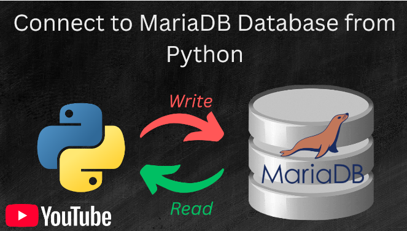
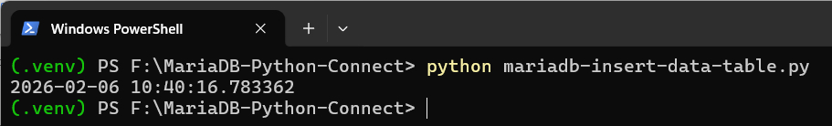
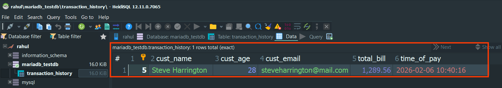
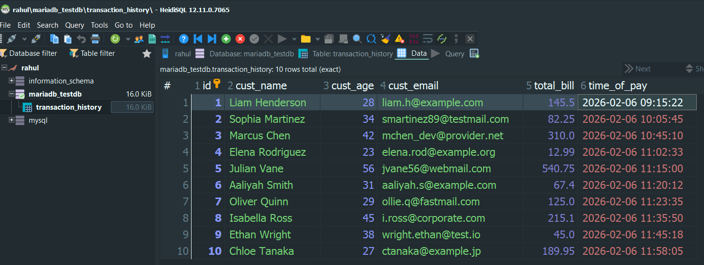
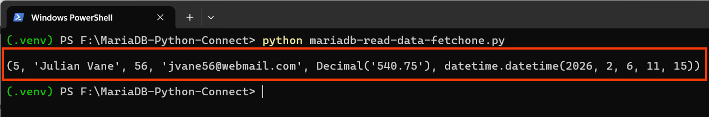
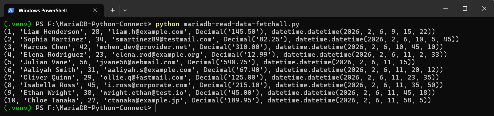

# Python MariaDB/MySQL Database Connection and CRUD Operations Tutorial

- In this repo we will learn how to connect to  a MariaDB/MySQL running locally on your System using Python and perform CRUD operations (CREATE,READ,UPDATE,DELETE).
- For connecting with MariaDB server from Python we will use the **MariaDB Connector/Python**
- MariaDB server running locally on our system
- We will also learn about basic MariaDB Database Administration like Creating Databases ,Creating Users,Granting Permissions to users etc 

## Youtube Tutorial
- 
- [Python MariaDB Connector Youtube Tutorial for Beginners](https://www.youtube.com/watch?v=2Cav22r_4KE)

## Online Tutorial

- [How to Connect to MariaDB Database from Python and Perform CRUD Operations](https://www.xanthium.in/install-mariadb-database-python-connection-windows11-crud-ops-tutorial)

## Notes

- We use VENV Virtual Environment to install MariaDB Python Connector here,If you are new to Python VENV,do check our [tutorial on configuring Python venv virtual environment on Windows 11](https://www.youtube.com/watch?v=XLs5b8SZCd0)
- Please note that we are hard coding our credentials into the source code which is not the best practice to follow.
- This is just a tutorial and the credentials are just for a throw away database 

```python
import mariadb
import sys

try:
   conn = mariadb.connect(
                           user="rahul",
                           password="EY4u^?%<_VB2tfY2",
                           host="localhost",
                           port=3306,
                           database="mariadb_testdb"
                         )

```

## Contents

- Installing MariaDB Connector/Python
- Connecting to the MariaDB Database using Python
- Creating a Table in MariaDB using Python
- Inserting a Row into MariaDB using Python
- Inserting Multiple Rows into MariaDB using Python
- Reading Rows from MariaDB using Python
	- fetchall() method
	- fetchone() method
	- fetchmany(n) method

## Writing Data into MariaDB Database using Python 

- Here is an example of inserting a single or multiple rows into the MariaDB Database using Python
- 
- 
- 


## Reading Rows from MariaDB Database using Python 
- 
- 

## References

- [Learn How to Configure Python VENV Virtual Environment on Windows 11](https://www.xanthium.in/configuring-python-virtual-environment-venv-tutorial-on-windows-linux-os) 
- [Python SQLite Programming Tutorials for Absolute Beginners](https://www.xanthium.in/connect-read-write-update-delete-sqlite3-database-python-cross-platform-tutorial)
