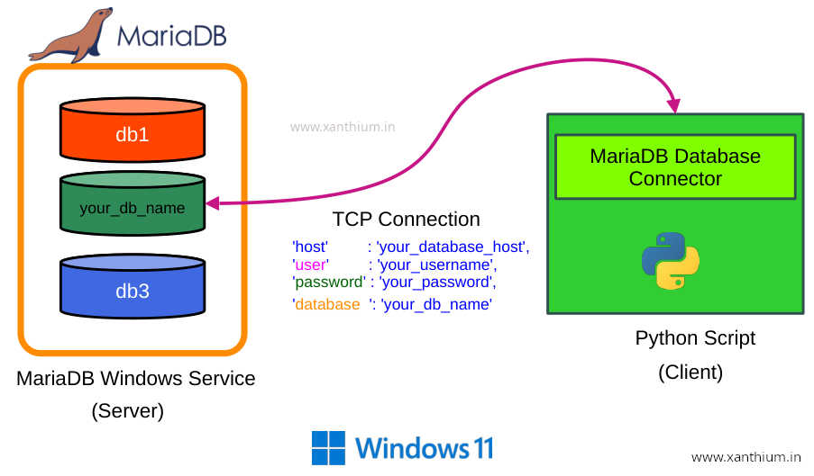

# Python MariaDB/MySQL Database Connection and CRUD Operations Tutorial

- In this repo we will learn how to connect to  a MariaDB/MySQL running locally on your System using Python and perform CRUD operations (CREATE,READ,UPDATE,DELETE).
- For connecting with MariaDB server from Python we will use the **MariaDB Connector/Python**
- MariaDB server running locally on our system
- We will also learn about basic MariaDB Database Administration like Creating Databases ,Creating Users,Granting Permissions to users etc 

## Online Tutorial

- [How to Connect to MariaDB Database from Python and Perform CRUD Operations](https://www.xanthium.in/install-mariadb-database-python-connection-windows11-crud-ops-tutorial)

## Notes

- Please note that we are hard coding our credentials into the source code which is not the best practice to follow.
- This is just a tutorial and the credentials are just for a throw away database 

```python
import mariadb
import sys

try:
   conn = mariadb.connect(
                           user="rahul",
                           password="EY4u^?%<_VB2tfY2",
                           host="localhost",
                           port=3306,
                           database="mariadb_testdb"
                         )

```